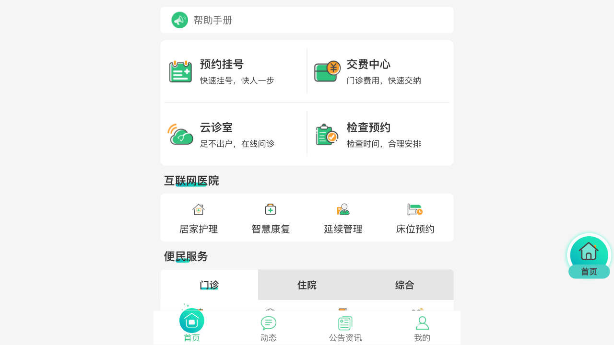

# 医院刷号脚本

## 工具
- playwright

## 说明
尝试抓接口，但是失败了，接口还需要验签，放弃走模拟请求了。想着之前看过 playwright 这类的工具可以做端到端测试，就拿来写自动化脚本试一试，在 ChatGPT 和文档的配合下，发现用 playwright 写自动化脚本还是相当便捷的。

为了测试的时候不需要一直登录，我的做法是将 cookies 和 localStorage 一起保存下来了，但这个网站的授权信息是存在了 sessionStorage 里，playwright 并没有直接可以使用的 API 用来保存 sessionStorage，但是文档给出了一种 Hack 写法，终于实现登录信息持久化。